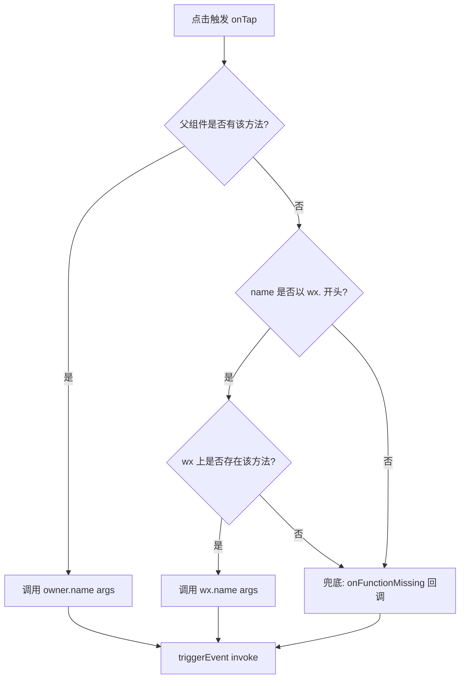

# @mini-dev/directive-views

用组件的方式调用小程序的 API —— 把原本要写 JS 的 `wx.*` 调用，封装成可以在 WXML 里直接声明的「指令式组件」，让调用方像写标签一样触发原生能力。

## 目录

1. [背景与目的](#1-背景与目的)
2. [安装](#2-安装)
3. [快速开始](#3-快速开始)
4. [组件清单](#4-组件清单)
5. [核心约定](#5-核心约定)
6. [示例](#6-示例)
7. [Changelog](#7-changelog)

## 1. 背景与目的

### 1.1 为什么要做这个库

在小程序里调用一个原生能力，通常要在 Page 的 JS 里绑定事件、再在回调里写 `wx.xxx(...)`。这样做有几个不便：

- **调用与视图分离**：按钮长在 WXML，逻辑长在 JS，改一个行为要在两个文件之间跳。
- **样板代码重复**：复制文本、拨打电话、路由跳转这类操作，每个页面都要重写一遍 `bindtap` + `wx.*`。
- **非 JS 侧难以驱动**：纯模板/配置场景下，没有方便的入口去触发一个原生动作。

`@mini-dev/directive-views` 的思路是：**把「调用一个能力」这件事，做成一个可以在模板里声明、用属性传参、点击即触发的组件**。能力被包进组件，调用方只需写标签，不再写 `bindtap` 和 `wx.*` 样板。

### 1.2 适用场景

- 想把常用 `wx.*` 操作（复制、拨号、路由、调试开关、任意函数调用）收敛成可复用标签的页面。
- 希望调用逻辑尽量贴近视图、由模板侧驱动的场景。
- 作为 `@mini-dev` 体系下的小工具库，配合其他 `@mini-dev` 组件使用。

### 1.3 不适用场景

- 复杂业务逻辑、需要大量回调编排的能力：组件是「轻量触发器」，不替代完整的业务封装。

## 2. 安装

```bash
npm install @mini-dev/directive-views --save
```

本库以**源码直发**方式提供（无构建产物），`package.json` 中的 `miniprogram` 字段指向 `libs` 目录，小程序「构建 npm」会直接使用源码。

## 3. 快速开始

### 3.1 引入组件

在页面的 `index.json` 里按需声明要用到的组件：

```json
{
    "usingComponents": {
        "copy": "@mini-dev/directive-views/copy/index",
        "debug": "@mini-dev/directive-views/debug/index",
        "function": "@mini-dev/directive-views/function/index",
        "route": "@mini-dev/directive-views/route/index",
        "call": "@mini-dev/directive-views/call/index"
    }
}
```

### 3.2 在模板里使用

引入后即可在 WXML 里像普通标签一样使用。绝大多数组件包裹一段内容（通过 `<slot/>`），点击该区域即触发对应能力：

```html
<copy value="你好">
    <button type="default">复制 value 的值</button>
</copy>
```

## 4. 组件清单

| 组件 | 作用 | 触发的原生能力 |
| --- | --- | --- |
| `<copy>` | 包裹内容，点击复制文本 | `wx.setClipboardData` |
| `<call>` | 包裹内容，点击拨打电话 | `wx.makePhoneCall` |
| `<debug>` | 调试开关按钮（开启 / 关闭） | `wx.setEnableDebug` |
| `<route>` | 路由跳转，支持别名 | `wx.navigateTo` / `redirectTo` / `reLaunch` / `switchTab` / `navigateBack` |
| `<function>` | 通用函数调用器，可调父组件方法或 `wx.*` | 任意 owner 方法 / `wx.*` |

### 4.1 copy 复制

通过 `value` 传字面量，或用 `variable` 从父组件 `data` 取值：

```html
<!-- 复制固定文本 -->
<copy value="你好">
    <button type="default">复制 value 的值</button>
</copy>

<!-- 复制父组件 data.text 的值 -->
<copy variable="text">
    <button type="default">复制 variable 的值</button>
</copy>
```

### 4.2 call 拨打电话

与 `copy` 取值方式一致，点击触发 `wx.makePhoneCall`，并通过 `success` / `fail` / `complete` 事件向上抛出结果：

```html
<call ext-class="mini-action" value="10086">拨打 10086</call>
```

### 4.3 debug 调试开关

提供「开启 / 关闭」两个按钮，文案可通过 `open` / `close` 属性配置，也可用具名 `slot` 自定义按钮内容：

```html
<!-- 直接配置文案 -->
<debug open="开启调试" close="关闭调试"/>

<!-- 用 slot 自定义按钮 -->
<debug>
    <button slot="open" type="primary">slot开启调试</button>
    <button slot="close" type="primary">slot关闭调试</button>
</debug>
```

### 4.4 route 路由跳转

通过 `url` 指定目标，`name` 指定路由类型；`name` 支持别名，未填默认 `navigateTo`：

| 标准类型 | 可用别名 |
| --- | --- |
| `navigateTo` | `navigate`、`to` |
| `redirectTo` | `redirect` |
| `reLaunch` | `launch` |
| `switchTab` | `switch`、`tab` |
| `navigateBack` | `back` |

```html
<route ext-class="mini-action" url="/pages/page2/index" auto/>
<route ext-class="mini-action" name="redirect" url="/pages/page2/index" auto/>
```

### 4.5 function 通用函数调用

`<function>` 是最通用的组件，把任意函数调用变成可声明的标签。通过 `name` 指定函数名、`arg` 传参（支持 JSON5 字面量），点击时按以下顺序查找并调用：



`arg` 支持对象或数组字面量：传对象会作为单个参数，传数组会按位置展开为多个参数：

```html
<!-- 对象参数：function1({name:'fn1'}) -->
<function ext-class="mini-action" name="function1" arg="{name:'fn1'}" auto/>

<!-- 数组参数：function2(1, 'a', {name:'fn1'}) -->
<function ext-class="mini-action" name="function2" arg="[1,'a', {name:'fn1'}]" auto/>

<!-- 调用 wx.* -->
<function ext-class="mini-action" name="wx.getDeviceInfo" auto/>
<function ext-class="mini-action" name="wx.canIUse" arg="['console.log']" auto/>
<function ext-class="mini-action" name="wx.navigateTo" arg="{url:'/pages/page2/index'}" auto/>
```

未命中任何方法时，若父组件定义了 `onFunctionMissing(name, args)`，会被回调；无论命中与否，都会通过 `invoke` 事件向上抛出 `{ name, args }`。

## 5. 核心约定

### 5.1 auto 模式

`<function>` 和 `<route>` 支持 `auto` 属性。开启后，组件会自动用调用签名（如 `function1({"name":"fn1"})`）作为展示文本，无需再手写 `<slot>` 内容——所见即所调：

```html
<!-- 直接渲染 "wx.navigateTo({url:'/pages/page2/index'})" 文本 -->
<route ext-class="route" url="/pages/page2/index" auto/>
```

### 5.2 取值方式：value 与 variable

`<copy>`、`<call>` 共用一套取值逻辑：`value` 取字面量，`variable` 从父组件 `data` 取同名变量。两者同时给出时 `value` 优先。

### 5.3 样式定制：ext-class 与 directive-class

所有组件统一注入了外部样式类 `ext-class` 与 `directive-class`，调用方可用它们覆盖组件根节点样式，无需 `::v-deep` 之类的穿透写法：

```html
<copy ext-class="my-copy" value="你好">复制</copy>
```

## 6. 示例

仓库自带一个完整演示小程序，覆盖每个组件的各种用法，可直接在微信开发者工具中打开运行。示例位于 `pages/` 目录：

```text
pages/
├── index/      # 入口：用 <route> 列出各演示页
├── copy/       # <copy> 的 value / variable 用法
├── call/       # <call> 拨打电话
├── debug/      # <debug> 文案配置与 slot 自定义
├── function/   # <function> 调父组件方法 / wx.* / 兜底
├── route/      # <route> 各路由类型与别名
└── page2/      # <route> 跳转目标页
```

## 7. Changelog

### 7.1 0.0.4

1. 新增 `<call>` 组件：包裹内容点击拨打电话（`wx.makePhoneCall`），支持 `success` / `fail` / `complete` 事件；
2. 抽取共享 Behavior（`libs/behaviors.js`）：`Value`（统一 `value` / `variable` 取值）与 `Function`（统一函数签名解析），`copy` / `route` / `function` 改为复用；
3. `<route>` 支持 `auto` 模式，并新增路由别名（`to` / `redirect` / `launch` / `switch` / `back` 等）；
4. **Breaking**：`<copy>` 取值属性 `var` 更名为 `variable`；
5. **Breaking**：`<route>` 路由类型属性 `type` 更名为 `name`。

### 7.2 0.0.3

1. 增加 `function` 的数组参数；
2. 统一 `ext-class` 的使用方式。

### 7.3 0.0.2

1. 修正针对小程序的 `package.json` 配置。

### 7.4 0.0.1

1. 添加常用的操作。
